# 无人值守Telegram机器人VIP频道管理系统

## 系统概述
本系统是一个无人值守的Telegram VIP频道管理系统，支持自动化的会员管理、支付处理和内容访问控制。系统分为三个主要模块：Telegram客户端、手机端H5界面和管理后台。

## 基础功能
- 通过邀请链接加入频道
- 付费订阅制度（按月付费）
- 支持虚拟货币支付（波场USDT）
- 会员过期管理
- 频道内容访问控制
- 管理后台功能

## 1. Telegram客户端使用指南

### 1.1 初始化使用（Start菜单）
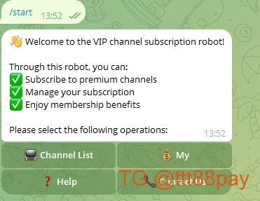

### 1.2 机器人主菜单
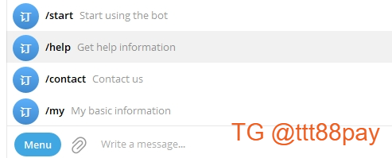

### 1.3 频道列表
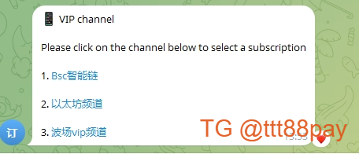

### 1.4 帮助指南

## 2. 手机端H5操作指南

### 2.1 频道浏览
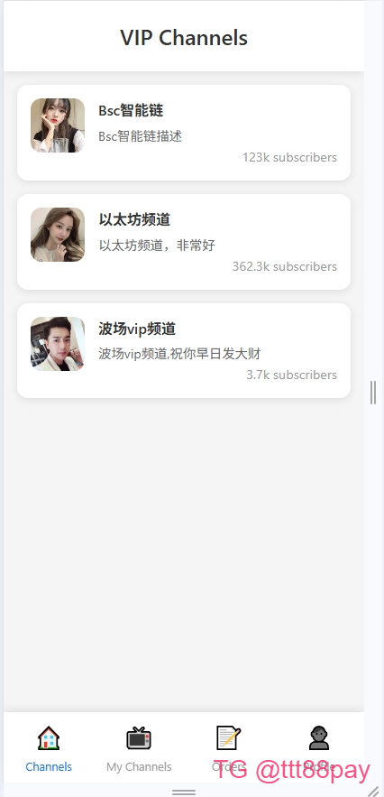

### 2.2 频道详情
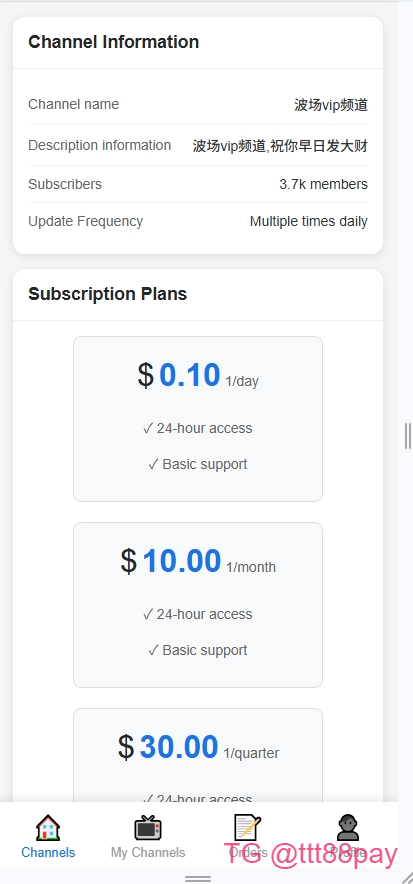

### 2.3 订单管理
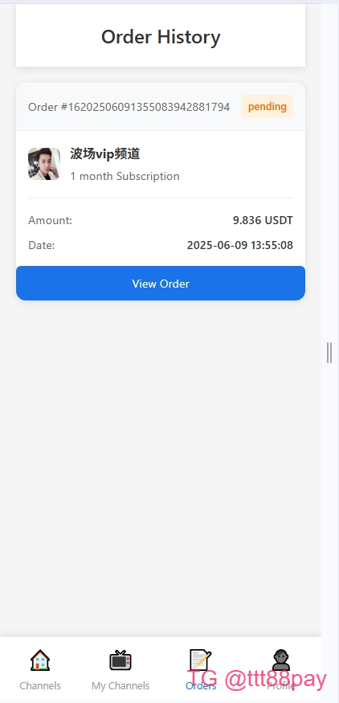

### 2.4 支付流程
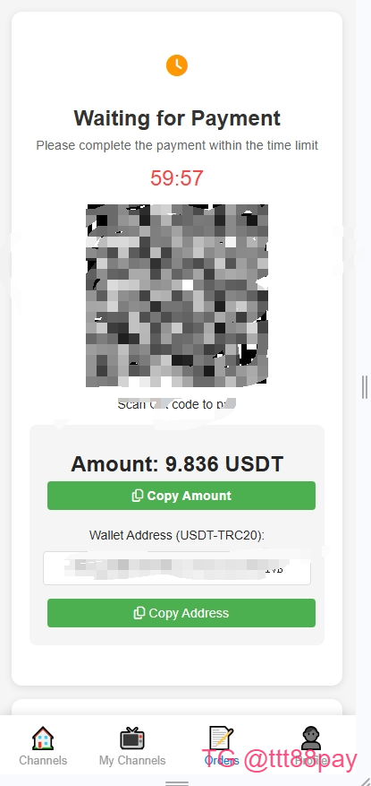

## 3. 管理后台使用手册

### 3.1 机器人管理
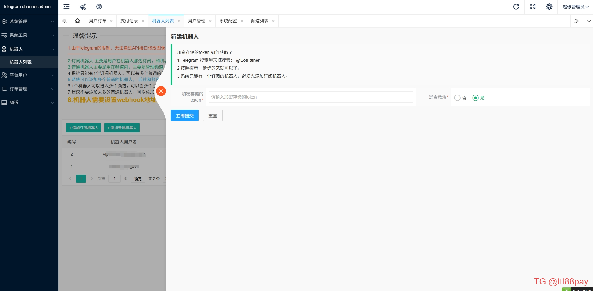
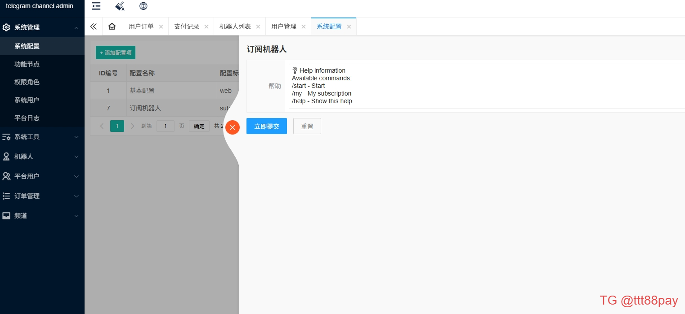

### 3.2 频道管理
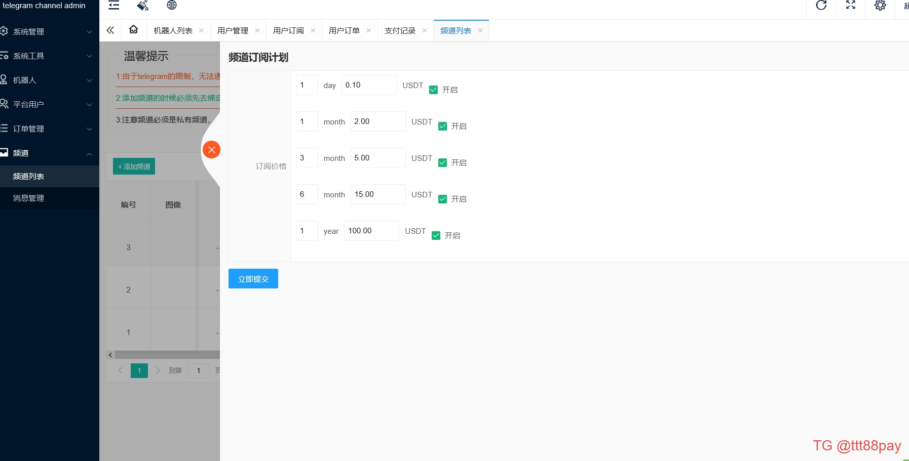
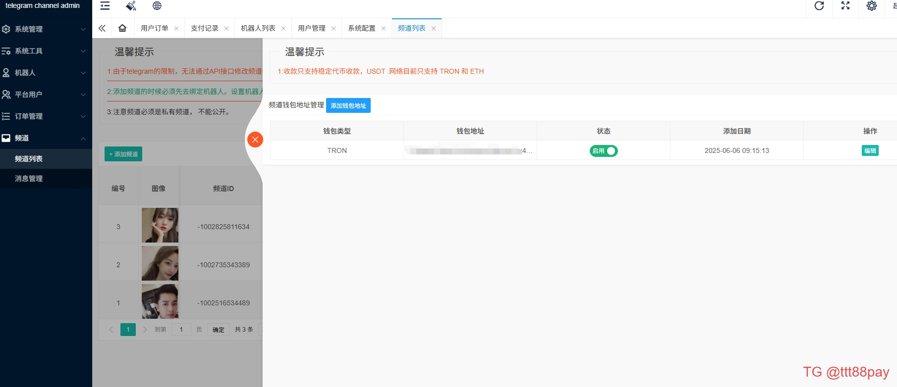

### 3.3 用户管理
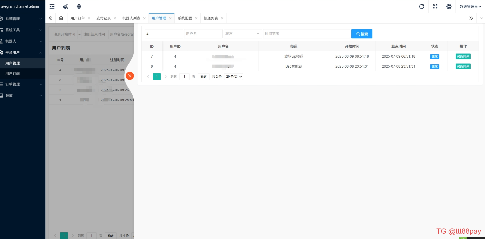
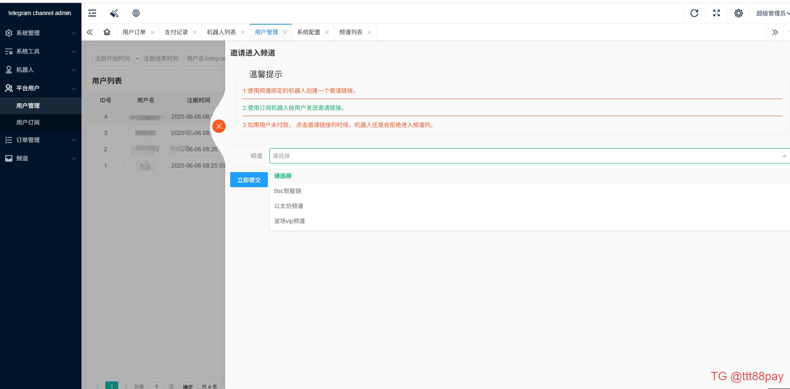

### 3.4 订单管理
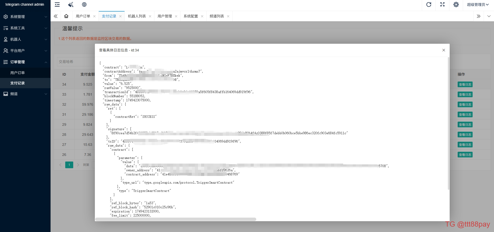
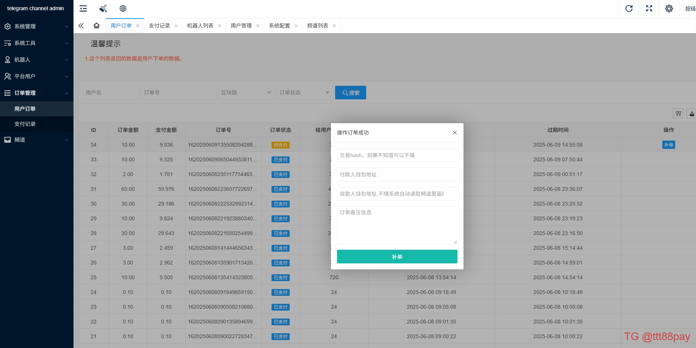

### 3.5 消息管理
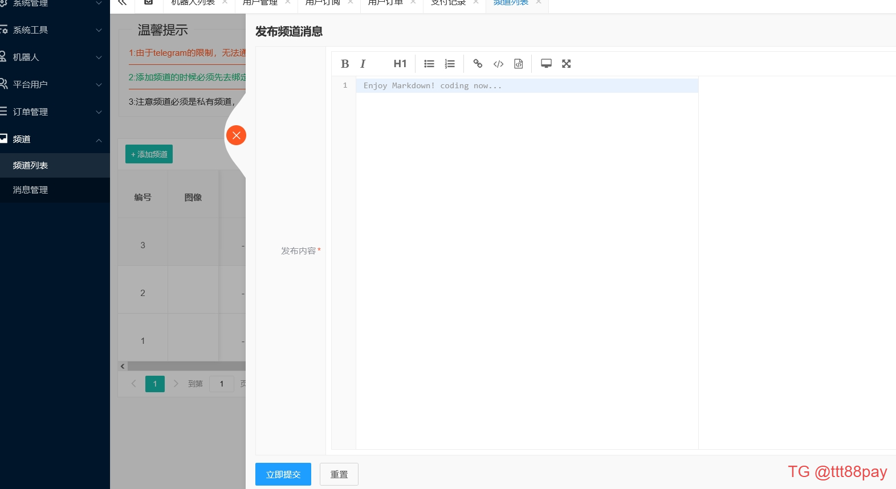
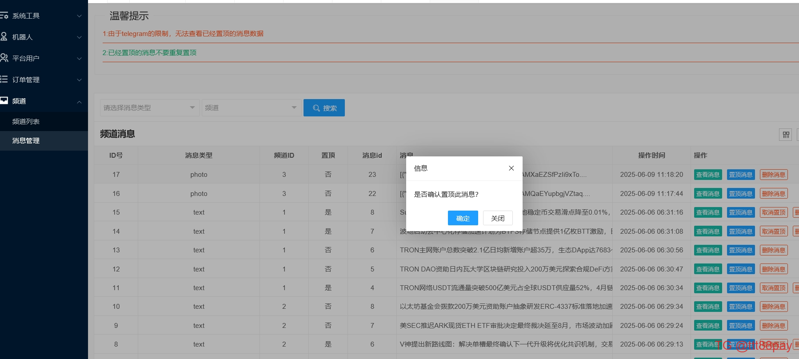

## 4. 系统监控
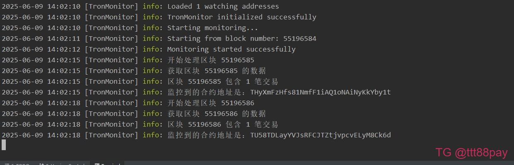

