# Unattended Telegram Bot VIP Channel Management System
README also available in: [中文](./README.md)
## System Overview
This system is an unattended Telegram VIP channel management system that supports automated member management and payment processing. The system consists of three main modules: Telegram client, mobile H5 interface, and admin backend.
You can apply this system to various industries. Users pay to join the channel, and you only need to periodically post quality content to earn passive income.

## Important Notes
This system's backend needs to be deployed on a server. The data is secure. This is first-hand source code, not second-hand, so please rest assured.

## Basic Features
- Join channels through invitation links: After users subscribe and pay, the bot automatically sends invitation links. Users click the link, the system automatically verifies, and they enter the channel. No manual intervention needed.
- Paid subscription system (monthly, daily, yearly payments)
- Support for cryptocurrency payments (TRON USDT)
- Admin backend functionality

# Important Notice
~~~
This system is not free, source code purchase required. The code is unencrypted, no authorization needed. Development languages: PHP + NodeJS. Built-in payment monitoring service, no third-party services needed.
Contact via TG: @ttt88pay
~~~

# Contact Information
## https://t.me/ttt88pay
## Please specify which system you need when contacting.

## 1. Telegram Client User Guide

### 1.1 Initial Setup (Start Menu)
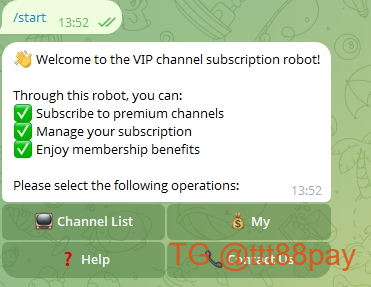

### 1.2 Bot Main Menu

### 1.3 Channel List

### 1.4 Help Guide

## 2. Mobile H5 Operation Guide

### 2.1 Channel Browsing

### 2.2 Channel Details

### 2.3 Order Management

### 2.4 Payment Process
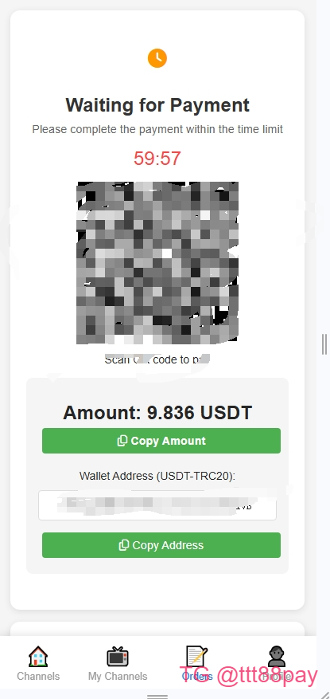

## 3. Admin Backend Manual

### 3.1 Bot Management
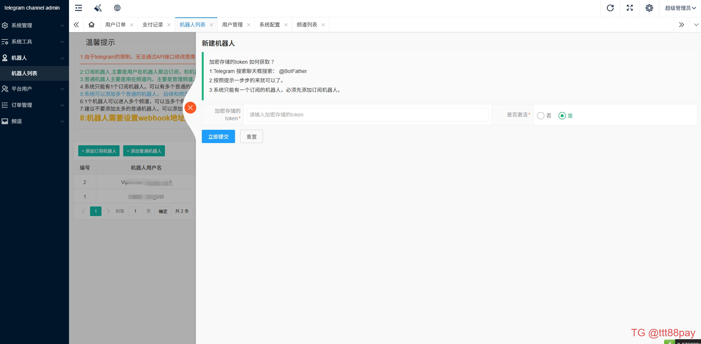
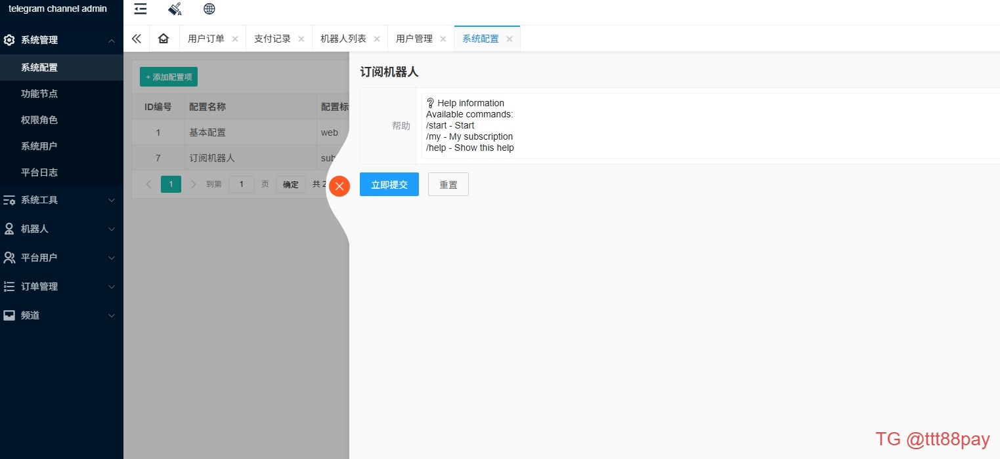

### 3.2 Channel Management
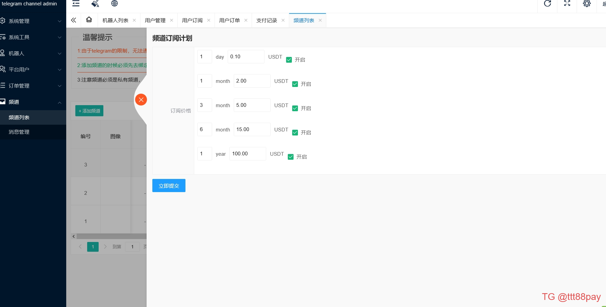
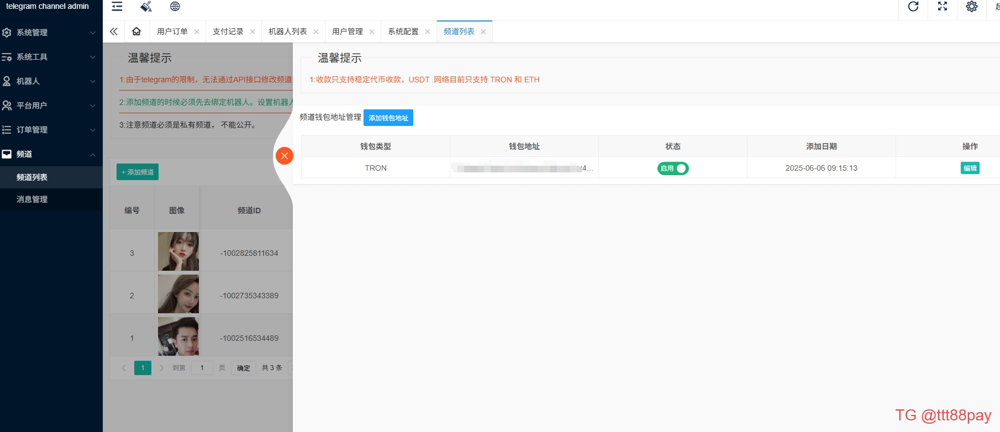

### 3.3 User Management
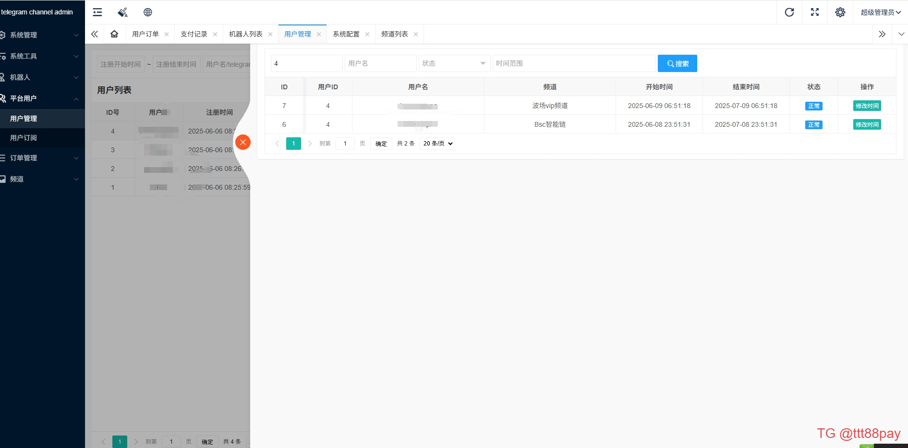
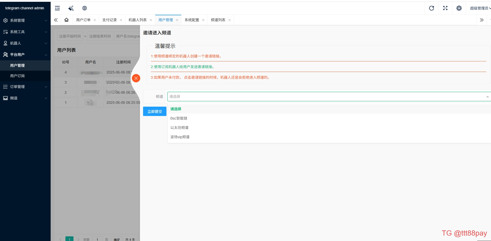

### 3.4 Order Management
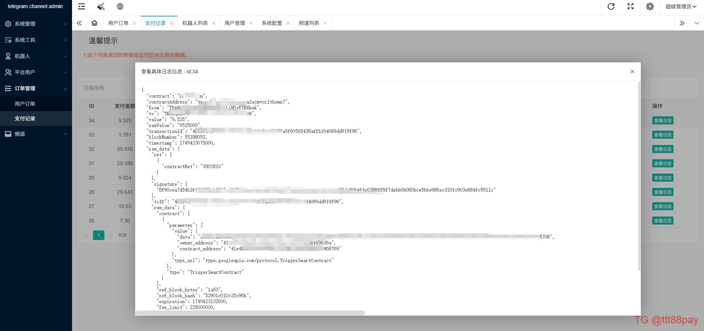

### 3.5 Message Management
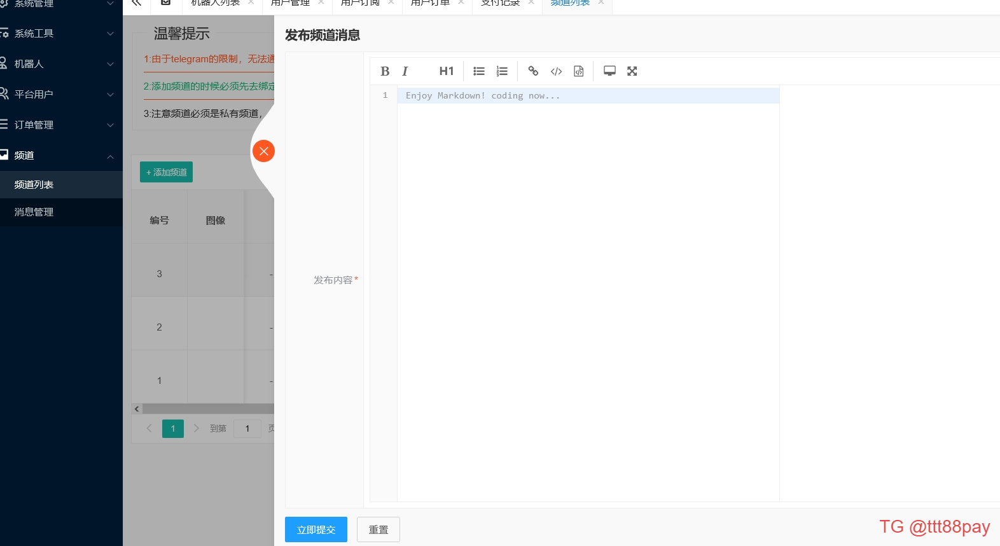
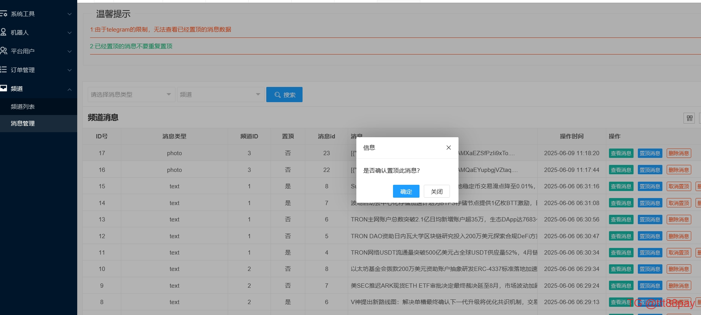

## 4. System Monitoring
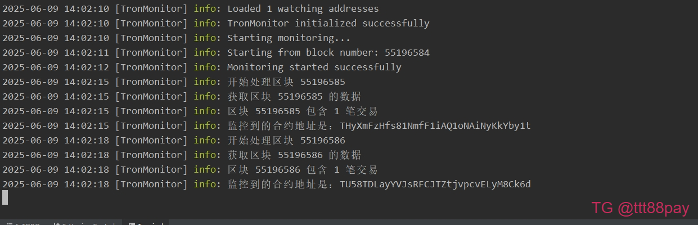